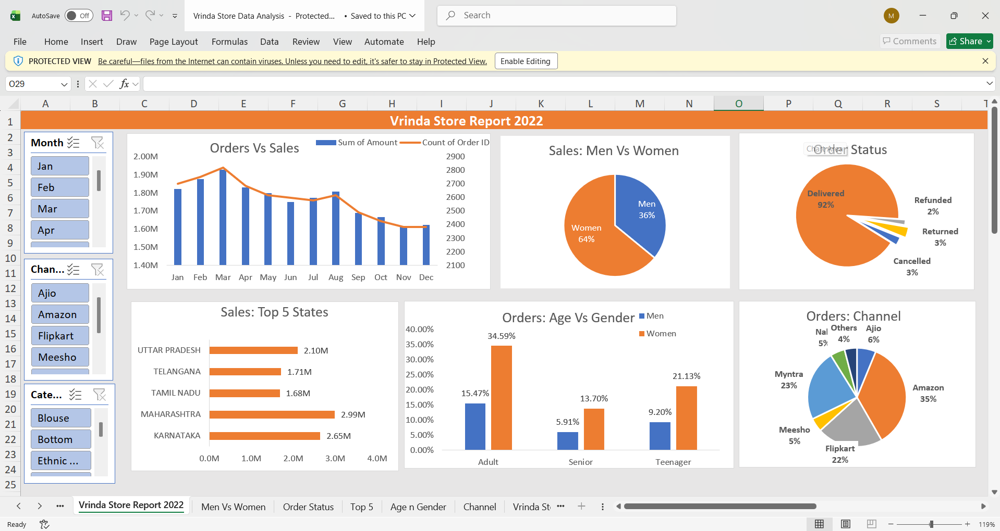

In this project, I developed an interactive dashboard to analyze the sales performance of Vrinda Store. The dashboard offers detailed insights into various aspects of the business, enabling stakeholders to make informed decisions.

Key highlights include: Monthly Orders and Sales, Customer Demographics, Order Status Overview, Regional Sales Performance, Sales Channels Distribution.

Insights: Women are more likely to buy compared to men (65%) Maharashtra, Karnataka and Uttar Pradesh are the top 3 States(35%) Adult age group (30-49 yrs) is max contributing (50%) Amazon, Flipkart and Myntra channels are max contributing (80%)

Final Conclusion to improve Vrinda Store Sales: Target women customers of age group (30-49 yrs) living in Maharashtra, Karnataka and Uttar Pradesh by showing offers/coupons available on Amazon, Flipkart and Myntra.

